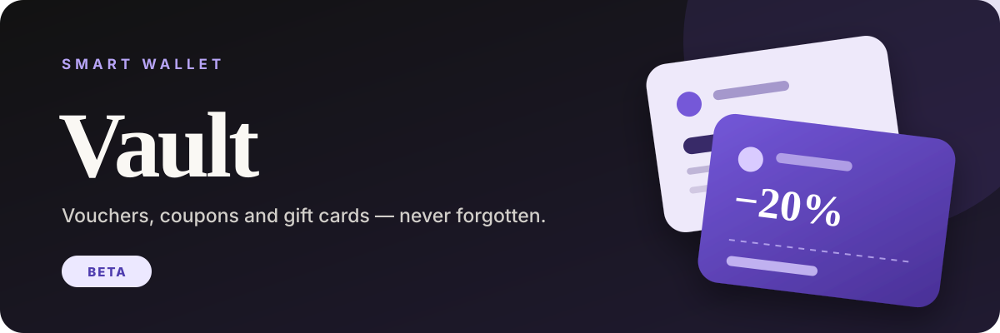
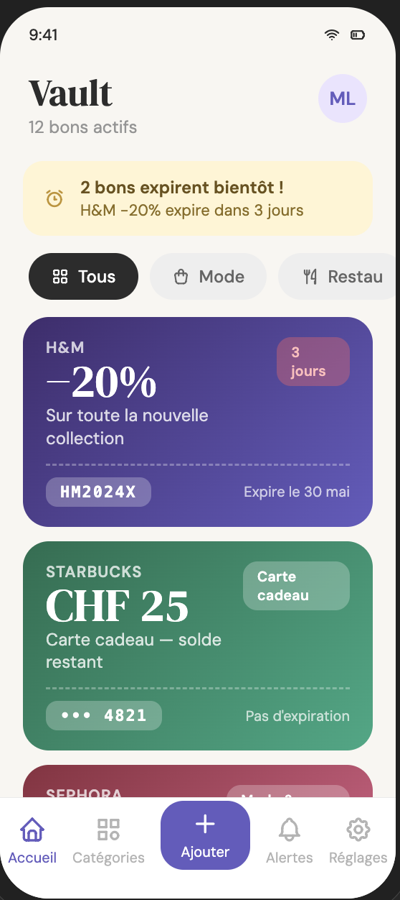
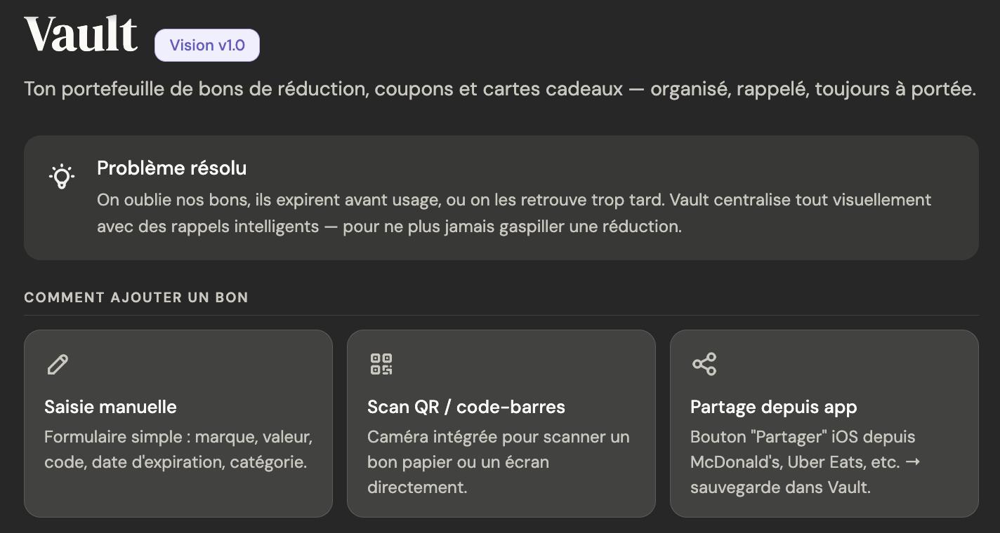

  

  <a href="README.en.md">English version</a>  
  <code>BÊTA</code>&nbsp; <code>iOS</code>

  <strong>Ton portefeuille de bons de réduction, coupons et cartes cadeaux — 
  organisé, rappelé, toujours à portée de main.</strong>

---

| Tout au même endroit | Moins d’oublis | Prêt au bon moment |
| :---: | :---: | :---: |
| Bons, coupons et cartes cadeaux réunis dans une seule app. | Des rappels clairs avant les dates d’expiration. | Les informations utiles accessibles au moment de l’achat. |

## Pourquoi Vault ?

Les bons et cartes cadeaux sont faciles à oublier. Ils restent dans un e-mail, une application ou un portefeuille jusqu’au jour où l’on découvre qu’ils ont expiré.

Vault les rassemble dans une interface unique et aide à les retrouver au bon moment.

  

## Ajouter un bon, sans friction

L’expérience est pensée pour enregistrer un bon dès sa réception : par saisie manuelle, en scannant un code ou depuis le menu de partage d’une autre application.

  

## La vision du produit

- Centraliser les bons de réduction, coupons et cartes cadeaux.
- Les organiser visuellement par catégories.
- Avertir avant une date d’expiration.
- Retrouver les informations utiles en quelques secondes.
- Garder ses bons disponibles sur ses appareils.

## Une expérience pensée pour le quotidien

Vault cherche à rendre une action très simple : enregistrer un bon dès sa réception, puis ne plus avoir à y penser jusqu’au moment où il devient utile.

La navigation reste directe, les cartes lisibles et les alertes compréhensibles en un coup d’œil.

---

### Statut

Vault est actuellement en **bêta**. Les fonctionnalités, la disponibilité et la tarification peuvent encore évoluer.

### À propos de ce dépôt

Ce dépôt est une vitrine publique du produit. Le code source, les détails techniques internes et les éléments confidentiels restent privés.

  <a href="mailto:koveo.agency@gmail.com"><strong>koveo.agency@gmail.com</strong></a>

